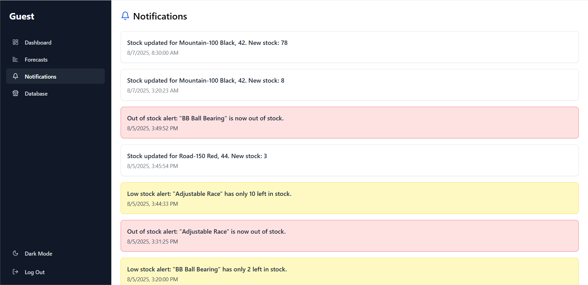

# 📊 AI-Driven Retail Dashboard

An **AI-powered inventory and forecasting system** that lets you seamlessly connect your Google Sheets inventory and get **real-time insights, notifications, and downloadable AI-generated reports** — all from one responsive, modern dashboard.

---

## 🛠 Tech Stack

**Frontend**
-  React.js — Component-based UI
-  Tailwind CSS — Styling
-  Recharts — Interactive charts
-  Lucide React — Icons
-  Formik — Form handling
-  Yup — Form validation
-  Axios — Request handling
- Socket io — Real Time connection

**Backend**
-  Node.js + Express.js — API server
-  Mongoose — MongoDB modeling
-  Google API — Sheets integration
-  Socket.IO — Real-time notifications

**AI/ML Service**
-  Flask — ML API
-  Pandas, NumPy — Data processing
-  ReportLab — PDF report generation
-  Custom ML models — Forecasting & insights

---

## 📸 Full Walkthrough with Screenshots

Below is a complete walkthrough of the application — from connecting your Google Sheets to receiving AI-generated PDF reports.

---

### 1️⃣ Dashboard Overview  
Your main control center — **real-time inventory**, sales summaries, and quick access to forecasting.  


---

### 2️⃣ Google Sheets Connection  
Easily connect your **Google Sheet** containing these tabs:  
`sales`, `clients`, `supplier`, `lead`, `products`.  
Our backend uses the Google Sheets API to sync data instantly.  


---

### 3️⃣ Inventory Updates in Real-Time  
Change stock levels right from the interface.  
Updated values sync with your Google Sheet instantly — and everyone gets notified.  


---

### 4️⃣ Notifications System  
Get **instant alerts** when inventory is updated or when new insights are generated.  



---

### 5️⃣ Forecast Type Selection  
Choose the type of forecast you need.  
The **sales tab** from Google Sheets is automatically exported as a CSV and sent to our **Flask AI API**.  


---

### 6️⃣ AI-Generated PDF Reports  
The Flask API processes your sales data and generates a detailed PDF report — including metrics, graphs, and demand forecasts.  
Reports are stored in the `screenshots` folder for reference.  


---

### 7️⃣ Responsive Design  
The dashboard adapts to **desktop, tablet, and mobile** so you can manage your business on the go.  


---

## ⚙️ How It Works

1. **Connect Google Sheets** with required tabs.
2. Backend fetches and updates **real-time inventory**.
3. Make stock updates from dashboard → instantly syncs with Google Sheets.
4. Choose forecast type → sales data sent to Flask API.
5. Flask API returns **PDF report** with AI-generated insights.
6. Dashboard updates instantly with insights and notifications.

---

## 📦 Installation

```bash
# Clone repository
git clone https://github.com/yourusername/ai-driven-retail-dashboard.git

# Backend
cd retail-backend
npm install

# Frontend
cd ../frontend
npm install
